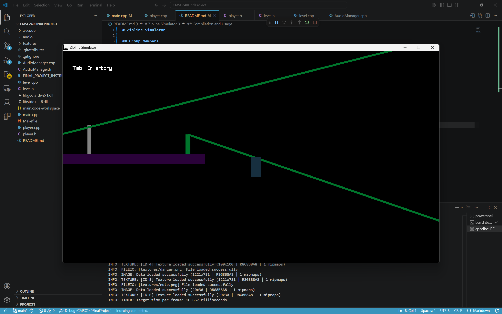
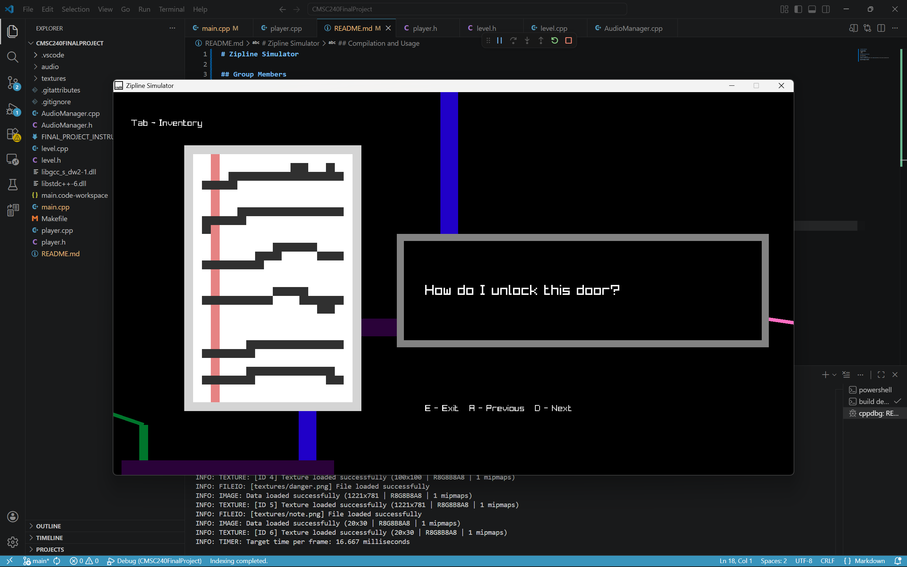

# Zipline Simulator

## Group Members

- Brendan Charen
- Kiet Lam
- Mitch Parker

## Purpose 
Students working on their finals need something to waste time on (Because games hit harder when you have stuff to do)

## Description

## Libraries Required

raylib -- install on windows from [raylib.com](https://www.raylib.com/index.html)

## Compilation and Usage

While in VSCode, click F5

## Example Usage

## AI Usage

REPLACE THESE LINES AND ADD YOUR USAGE
A section describing any AI tools used (including chat conversation links).

Asked Chatgpt to write a function splitting lines into smaller sections and stores them in a vector.
https://chatgpt.com/share/69f052ca-a94c-83ea-b386-d625c3e21656